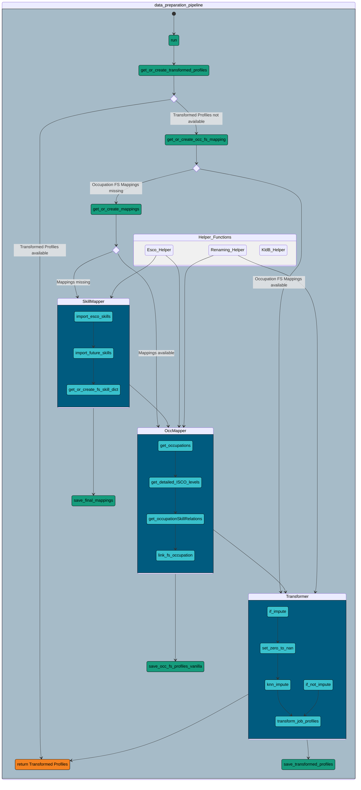
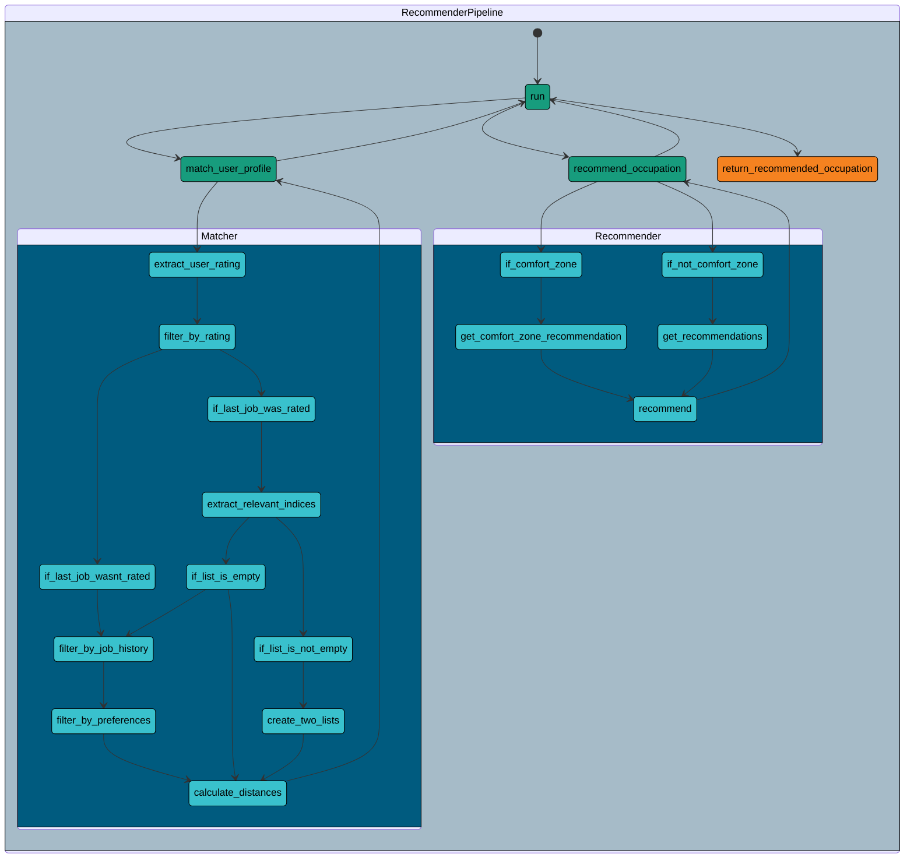

# Source Code Overview

## Table of Contents

1. [Introduction](#introduction)
2. [Directory Structure](#directory-structure)
3. [Modules and Class Descriptions](#modules-and-class-descriptions)
4. [Pipeline Description](#pipeline-description)

## Introduction

This directory contains the source code for the project. Below is an overview of the structure, detailed descriptions of the various modules and scripts, and information on the classes and pipelines defined in the project.

## Directory Structure

```
src/
├── interfaces/                         # Contains the abstract classes
│   ├── mapperAbstract.py               # Abstract base class for a mapping system.
│   |── matcherAbstract.py              # Abstract base class for a matching system.
|   |—— occMapperAbstract.py            # Abstract base class for mapping FS to occupation profiles.
|   |—— recommenderAbstract.py          # Abstract base class for a recommender system.
|   |—— transformerAbstract.py          # Abstract base class for a transformation system.
├── models/                             # Contains implementation of classes
│   ├── mapper/
|   |   └── skill_mapper.py             # Implements SkillMapper Class.
│   ├── matcher/
|   |   └── matcher.py                  # Implements JobMatcher Class.
│   ├── occ_mapper/
|   |   └── occ_mapper.py               # Implements OccFSMapper Class.
│   ├── recommender/
|   |   └── recommender.py              # Implements JobRecommender Class.
│   └── transformer/
|       └── occ_transformer.py          # Implements OccTransformer Class.
└── pipeline/                           # Contains data pipelines
    ├── data_preparation_pipeline.py    # Implements Data Preparation Pipeline.
    └── recommender_pipeline.py         # Implements Recommender Pipeline.

data, misc?
```

## Modules and Class Descriptions

### SkillMapper

**Description**:  
`SkillMapper` is a class responsible for mapping and managing skills from ESCO (European Skills, Competences, Qualifications, and Occupations) and future skills datasets. It extends the `Mapper` class and performs various operations related to skill data processing and transformation.

**Input Parameters**:

- `mapping_path` (str): Path to the skill mapping file.

**Example:**

```python
from mapper.skill_mapper import SkillMapper

# Define path to mapping
path_to_mapping = 'path_to_mapping_location/mappings.csv'
# Define path to ESCO data
esco_path = 'path_to_esco_data/ESCO/'
# Initialize the class
mapper = SkillMapper(path_to_mapping)

# Call a method
future_skill_dict = mapper.create_fs_dict(esco_path)
```

---

### OccFSMapper

**Description**:  
`OccFSMapper` is designed to create and manage mappings between occupations and future skills. It extends the `OccMapper` class and aggregates, transforms, and scales future skills data to produce occupation-specific skill profiles.

**Input Parameters**:

- `agg_by` (str, default="occupationUri"): Specifies the column by which to aggregate the data.
- `weighted` (bool, default=True): Whether to apply weighting to the skill counts.
- `only_essential` (bool, default=True): Whether to include only essential skills in the mapping.
- `exclude_knowledge` (bool, default=True): Whether to exclude skills categorized as "knowledge".

**Example:**

```python
from occ_mapper.occ_mapper import OccFSMapper

# Define Future Skills dict
fs_dict = {'URI':['FS1', 'FS2']} #A dictionary mapping URIs to FutureSkills
# Define path to ESCO data
esco_path = 'path_to_esco_data/ESCO/'
# Initialize the class
occ_fs_mapper = OccFSMapper()

# Call a method
occ_fs_df = occ_fs_mapper.create_occ_fs_mapping(fs_dict, esco_path)
```

---

### OccTransformer

**Description**:  
`OccTransformer` is a class for transforming occupation profiles to align with reference user profiles. It extends the `Transformer` class and performs data transformation techniques including scaling, power transformation, and imputation.

**Input Parameters**:

- `reference_user_profiles` (str, optional): Path to the reference user profiles CSV file.
- `impute` (bool, default=True): Whether to impute missing values.
- `n_neighbors` (int, default=10): Number of neighbors to use for KNN imputation.
- `occ_profiles_vanilla` (pd.DataFrame, optional): A DataFrame of vanilla occupation profiles.

**Example:**

```python
from transformer.occ_transformer import OccTransformer
import pandas as pd

# Define path to user profiles
reference_user_profiles = 'path_to/user_profiles.csv'

# Define DF with occupation future skills profiles.
occ_fs_profiles = pd.read_csv('path_to_occ_fs_profiles')

# Initialize the class
transformer = OccTransformer(reference_user_profiles)

# Call a method
occ_fs_df = transformer.transform(occ_fs_profiles)
```

---

### JobRecommender

**Description**:  
The `JobRecommender` class is part of a larger recommendation system that uses user profiles to generate job recommendations. It inherits from the `Recommender` class, leveraging user data to provide personalized job suggestions based on predefined criteria.

**Input Parameters**:

- `user_profile`(numpy array, default=None) : A numpy array representing the user's future skill profile.

**Example:**

```python
from recommender.recommender import JobRecommender

# Define path to user profiles
reference_user_profiles = 'path_to/user_profiles.csv'

# Define path to transformed occupation profiles
transformed_occ_profiles = 'path_to/transformed_occupation_profiles.csv'

# Define target user profile
target_profile = 'get profile from API'
preferences = 'get preferences from API'

# Initialize job recommender
job_recommender = JobRecommender(reference_user_profiles)

# run job recommender
job_recommender.run(target_profile, preferences, transformed_occ_profiles, user_profiles)
```

---

### JobMatcher

**Description**:  
The `JobMatcher` class is specialized in matching job profiles to user queries using distance calculation methods. It extends the `Matcher` class, allowing customization of the distance metric to use either Euclidean or cosine similarity for a more tailored job matching process.

**Input Parameters**:

- `method` (str, default="euclidean"): Specifies the method for distance calculation, options are "euclidean" or "cosine".

**Example:**

```python
from matcher.matcher import JobMatcher

# Define path to user profiles
reference_user_profiles = 'path_to/user_profiles.csv'

# Define path to transformed occupation profiles
transformed_occ_profiles = 'path_to/transformed_occupation_profiles.csv'

# Define target user profile
target_profile = 'get profile from API'

# Define method to calculate distances, either 'cosine' or 'euclidean'
method = 'euclidean'

# Initialize job recommender
job_matcher = JobMatcher(method)

# run job recommender, pass either transformed occupation profiles or reference user profiles
job_matcher.calculate_distances(target_profile, transformed_occ_profiles, sorted=True)
```

## Pipeline Description

```mermaid

flowchart
    classDef Pipe fill:#A6BBC8,stroke:#ffffff,stroke-width:2px,font-size:20pt,padding-bottom:80pt,rankSpacing:80px,color:#ffffff;
    classDef start fill:#008598,stroke:#ffffff,stroke-width:2px,color:#ffffff;
    classDef greenState fill:#179C7D,stroke:#ffffff,stroke-width:2px,font-size:15pt,color:#ffffff;
    classDef blueState fill:#005B7F,stroke:#ffffff,stroke-width:5px, font-size:20pt, padding-bottom:50px, rankSpacing:10,color:#ffffff;
    classDef edgeLabel font-size:20px,fill:#000,stroke:#000,stroke-width:1px;
    classDef subgraph_padding fill:none,stroke:none

    subgraph Pipeline[Pipeline&nbsp&nbsp;]

        direction LR

        A[Start] --> B
        subgraph subgraph_padding1 [ ]
        subgraph DataPrep[Data Preparation Pipeline]
        direction LR
            B{Check available files}
            B --> |Mappings\n not available| C[SkillMapper]
            C --> D[OccFSMapper]
            D --> E[OccTransformer]
            B --> |"Mappings but no\n Occupation mappings (final)"| D
            B --> |"Occupation mappings\n not transformed (vanilla)"| E
        end


        subgraph Recommender[Recommender Pipeline]
            E --> F[JobMatcher]
            F --> G[JobRecommender]


        end
        end

        B --> |"Transformed Occupation\n profiles available (transformed)"|F
    end



class B,C,D,E,F,G greenState
class Pipeline Pipe
class DataPrep,Recommender blueState
class A start
class subgraph_padding1 subgraph_padding

```



### Data Preparation Pipeline

**Description:**  
The `DataPrepPipeline` class implements the data preparation pipeline for the KIRA project. This class handles the end-to-end process of preparing data for the recommender system, including skill mapping, occupation-skill mapping, and transforming profiles. It ensures that the necessary data is processed and saved at each stage.

**Input Parameters:**

- `mapper` (Optional[Mapper]): An instance of the `Mapper` class used for creating skill mappings.
- `occ_mapper` (Optional[OccMapper]): An instance of the `OccMapper` class used for creating occupation-skill mappings.
- `transformer` (Optional[Transformer]): An instance of the `Transformer` class used for transforming profiles.
- `data_path` (str): The base path for data storage (default is `"data/"`).



---

### Recommender Pipeline

**Description:**  
The `RecommenderPipeline` class implements the recommender pipeline for the KIRA project. This class takes user profiles and personal preferences, matches them with transformed occupation profiles, and generates recommendations. It integrates the matcher and recommender components to provide suitable occupation suggestions to users based on their profiles and preferences.

**Input Parameters:**

- `matcher` (Optional[Matcher]): An instance of the `Matcher` class used for matching user profiles with occupation profiles.
- `recommender` (Optional[Recommender]): An instance of the `Recommender` class used for generating occupation recommendations.
- `data_path` (str): The base path for data storage (default is `"data/"`).


